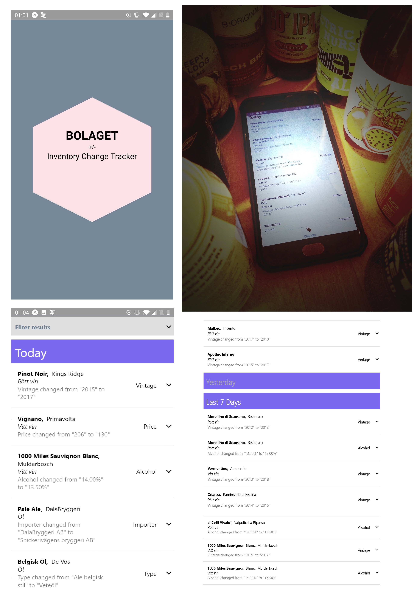

# bologat-inventory-change-tracker

React Native app displaying changes to the System Bolgat inventory.

Show changes in price, vintage, producer, alcohol content, packaging etc

|||
|-------------|-------------------|
| **Frontend**  |<a href="http://bolaget.surge.sh" target="_blank">bolaget.surge.sh</a>|




# Setup

Update your node and npm versions from here [https://nodejs.org/en/download/](https://nodejs.org/en/download/), and get yarn here [https://yarnpkg.com/lang/en/docs/install/#windows-stable](https://yarnpkg.com/lang/en/docs/install/#windows-stable)

```sh
cd app
yarn
yarn run web
```

You need a backend as well. By default (in *appsettings.json*) it will use a local express server.
In the second window, run this:


```sh
cd fakebackend
yarn
yarn run live
```


# (Docker Setup)

```sh
docker-compose up --build
```

And just like that everything will start running. The app will run on http://localhost:19006/. You have hot reloading and can start developing.

However there are a few annoying issues. Firstly, "clear site data" needs to be run before new changes to the app code can be seen in the browser. The developer console (`http://localhost:19002/`) also isn't there. I wouldn't currently recommend developing expo apps from docker. I'd recommend following the non-docker instructions.

# Running on another device #

If you want to run the app using your phone on lan you'll need to also go into *appsettings.json* and change the `baseUrl` from *localhost* to your ip.

# Lint #

```sh
cd app
yarn run lint
```

# Deploy #

Install :
```sh
npm install -g surge
```

Then make sure the appsettings.json is configured to your environment.

```sh
cd app
yarn
yarn run build-web
cd web-build
surge
```

and then follow the instructions on the command line.
